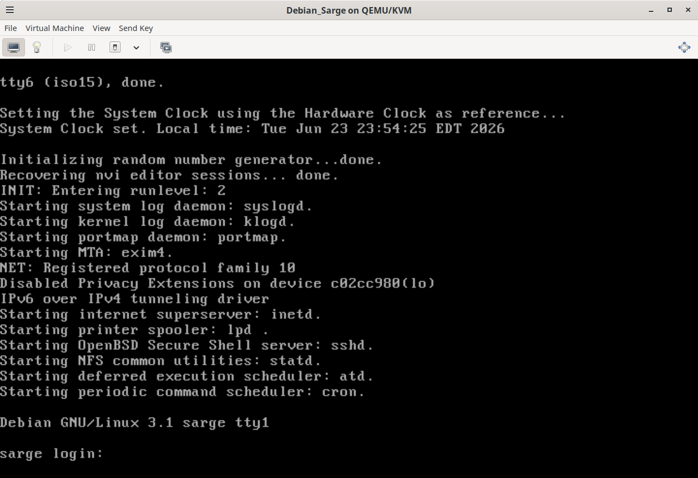
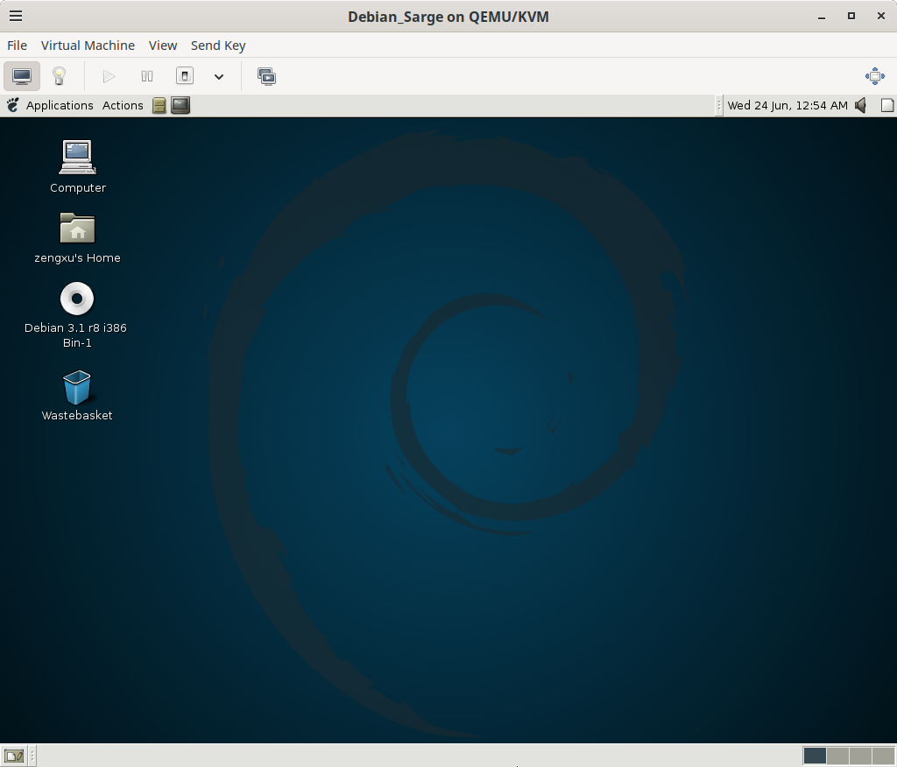

* Setup
** The Host Computer
The host computer is a PC running a modern Linux distribution. Make sure it supports virtualization as we will use QEMU/KVM to run a Debian Sarge VM. I use Debian Trixie. The instructions in this book are based on Debian Trixie. You may need to adjust them slightly if you use a different Linux distribution.

In Debian Trixie, install the following packages:
#+begin_src bash
  sudo apt install virt-manager
#+end_src
** QEMU
*** Preparation
This driver runs on Linux kernel 2.6. The easiest way to develop it is creating a QEMU virtual machine that runs Debian 3.1 Sarge, which contains Linux kernel 2.6.8.

Before installing a VM, we need to first download Debian Sarge ISO files for the IA-32 platform. You can download them from [[https://archive.org/details/debian-sarge-r8-32bit][Internet Archive]].

*** VM Creation
After downloading the ISO files, open =virt-manager= and create a virtual machine follwing the steps below.
1. Choose "Local install media (ISO image or CDROM)", then click "Forward".
2. Click "Browse" and choose the "debian-31r8-i386-binary-1-CD.iso" file just downloaded. Click "Open". Uncheck "Automatically detect from the installation media/source" and type "generic" to choose "Generic or unknown OS. Usage is not recommended". Click "Forward".
3. Set "Memory" to 512 MiB[fn:mib] and "CPUs" to 1. Click "Forward".
4. In "Create a disk image for the virtual machine", set it to 10.0 GiB. Click "Forward".
5. In "Name", type a name without spaces, such as "Debian_Sarge". Check "Customize configuration before install". Click "Finish".
6. Click "NIC ...", select "rtl8139" in "Device model". Click "Apply". This is the network card we will develop a driver for.
7. Click "Video QXL", select "VGA" in "Model". Click "Apply". Debian Sarge does not work on modern video emulation.
8. Click "Tablet", then click "Remove". Debian Sarge does not understand "Absolute Movement".
9. Click "Begin Installation" to install Debian Sarge.

*** OS Installation
When installing Debian Sarge:
1. At the boot prompt, do not press Enter. Type =linux26=. Debian Sarge supports both Linux kernel 2.4 and 2.6.
2. In "Choose a language", choose your language. This book is based on English.
3. In "Partition method", it is recommended to select "Erase entire disk".
4. In "Partition scheme", it is recommended to select "All files in one partition".
5. In "Install the GRUB boot loader to the master boot record", choose "Yes". Those OS will reboot and continue configurations.
6. In "Time zone configuration", "Is the hardware clock set to GMT?", choose "No". =virt-manager= uses UTC clock by default.
7. In "Archive access method for apt", choose "cdrom". Debian Sarge is too old to find online package repos.
8. Click the lightbulb icon of the virtual machine, then click "IDE CDROM 1". In "Source path", browse to your downloaded file =debian-31r8-i386-binary-1-DVD.iso=. Click "Apply". Click the monitor icon and in "CD-ROM device file", choose the default one.
9. In "Scan another CD?", click the lightbulb icon of the virtual machine, then click "IDE CDROM 1". In "Source path", browse to your downloaded file =debian-31r8-i386-binary-2-DVD.iso=. Click "Apply". Click the monitor icon and choose "Yes".
10. Debian Sarge will then ask you to insert the first DVD.
11. In =Choose software to install=, leave them unselected.
12. In "General type of mail configuration", choose "no configuration at this time".
13. The OS installation and setup is done. You will be greeted by a login prompt.
    #+caption: Debian Sarge VM
    #+name: fig:debian_sarge_vm
    #+attr_latex: :width 0.9\textwidth :placement [htbp]
    

*** (Optional) Desktop Installation
Optionally, you can install a GUI desktop environment.
1. Login as root, run =apt-get install x-window-system-core gnome-desktop-environment xscreensaver gdm= to install the Gnome desktop.
2. In "Do you want to entrust font management to defoma", choose "Yes".
3. In "Do you want the cdrecord binaries to be installed SUID root?", choose "No".
4. In "Please choose your sound daemon's dsp wrapper", choose "none".
5. In "Which paper size should be the system default", choose your paper size. I use "a4".
6. In "Attempt to autodetect video hardware?", choose "No".
7. In "Select the desired X server driver", choose "vesa".
8. In "Please select the XKB rule set to use.", type "xfree86".
9. In "Please select your keyboard model.", type "pc104".
10. In "Please select your keyboard layout.", type your keyboard layout. I typed "us".
11. In "Please choose your mouse port.", choose "/dev/input/mice".
12. In "Is your monitor an LCD device?", choose "No".
13. In "Please choose a method for selecting your monitor characteristics.", choose "Simple".
14. In "Please choose your approximate monitor size.", choose "17 inches (430 mm)".
15. In "Select the video modes you would like the X server to use", check "1024x768".
16. In "Please select your desired default color depth in bits.", choose "24".
17. The desktop environment will be installed. After that, reboot your VM and you will be greeted by a login window. Log in with your credential and you then enter a beautiful early Debian Gnome desktop environment.
    #+caption: Debian Sarge Desktop
    #+name: fig:debian_sarge_desktop
    #+attr_latex: :width 0.9\textwidth :placement [htbp]
    

** Miscellaneous
:PROPERTIES:
:CUSTOM_ID: sec:miscellaneous
:END:
It is almost done. There are still some miscellaneous configurations.

1. You need to make your account a sudoer in order to use =sudo=. First run =su -= and enter the root password. Then edit =/etc/sudoers= with your favorite editor. Add a line like =zengxu ALL=(ALL) ALL= where you should replace =zengxu= with your account name.
2. Blacklist the builtin RTL8139 driver so that you can work on your own driver without worrying about conflicts.
   1. Unload the builtin driver.
      #+begin_src text
	sudo rmmod 8139too
	sudo rmmod 8139cp
      #+end_src
   2. Enter =sudo vi /etc/modprobe.conf= and add
      #+begin_src text
	install 8139too /bin/true
	install 8139cp /bin/true
      #+end_src
   3. Enter =sudo nano /etc/hotplug/blacklist= and add
      #+begin_src text
	8139too
	8139cp
      #+end_src
   4. Reboot the VM and confirm that the builtin driver is blacklisted by =lsmod | grep 8139=.
3. Since we blacklisted the builtin Ethernet driver, the VM does not have a network connection. To share files between the host computer and the VM, we will use a virtual USB drive.
   1. On the host computer, run =dd if=/dev/zero of=/home/zengxu/Projects/shared_storage.img bs=1M count=512= to create a 512 MiB image.
   2. Run =sudo virsh attach-disk Debian_Sarge /home/zengxu/Projects/shared_storage.img sda --driver qemu --type disk --subdriver raw --targetbus usb --live= to create a live USB drive on the VM.
   3. Run =dmesg | tail -n 20= to make sure it is detected by the kernel on the VM. You should also see a device file =/dev/sda=.
   4. Run =sudo apt-get install dosfstools= to install =mkfs.vfat=.
   5. Format the virtual USB drive by =sudo mkfs.vfat -I -F 32 /dev/sda=.
   6. Mount the virtual USB drive by:
      #+begin_src bash
	sudo mkdir /mnt/storage
	sudo mount -t vfat /dev/sda /mnt/storage/
      #+end_src
   7. Verify the mount by =df -h=.
   8. On the host, make two scripts executable by =chmod +x grab_from_vm.sh return_to_vm.sh=.
   9. To unmount the disk from the VM and mount it on the host computer. Enter =sync;sudo umount /mnt/storage= on the VM and execute =./grab_from_vm.sh= on the host computer. It will be mounted at =/mnt/shared_storage=.
   10. To remount the disk on the VM, execute =./return_to_vm.sh=. If you installed Gnome desktop, the VM may automount it at =/media/usbdisk=. If not, just mount it manually. You can share files between the host computer and the VM offline using this method.

[fn:mib] A GiB (Gibibyte) or MiB (Mebibyte) is a binary unit of digital information defined by the IEC. Unlike decimal Megabytes (MB) which use powers of 10 ($10^6$ bytes), binary units are based on powers of 2, where $1 \text{ MiB} = 2^{20}$ bytes (1,048,576 bytes). Technical systems like the Linux kernel measure memory this way.
